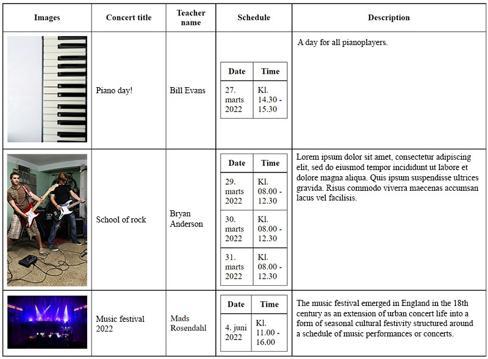

# API-Website
Unstyled PHP code to pulls data from the SpeedAdmin API.

Remember to change the authorization code in the config file!

Get API info here: https://api.speedadmin.dk/Help

## Todo

- [x] News page
- [x] Teacher list page
- [x] Courses pages - displays a page about eg. guitar lessons (Courses API)
- [x] Grab, display and store images from database
- [x] Concert list - lists the upcoming concerts (Booking API)
- [ ] ~~List content of each concert (who is playing and what song are they playing)~~

## Contributors
- Mads Rosendahl
- Frederik Feichtmeier
- Paul Kepinski

## Todo
Screenshot of _concerts_advanced.php_

